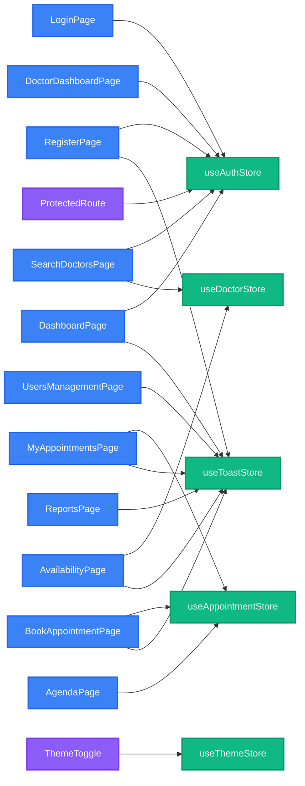

# Arquitectura de Estado — MediQ Frontend

Este documento describe el sistema de gestión de estado global de MediQ, implementado con **Zustand v5**. El proyecto utiliza 5 stores especializados que gestionan diferentes dominios de la aplicación.

---

## Tabla Resumen de Stores

| Store | Propósito | Estado Principal | Acciones Clave | Páginas Consumidoras |
|-------|-----------|------------------|----------------|---------------------|
| `useAuthStore` | Autenticación y sesión de usuario | `user`, `isAuthenticated`, `isLoading`, `error` | `login()`, `register()`, `logout()`, `checkSession()` | LoginPage, RegisterPage, SearchDoctorsPage, DoctorDashboardPage, DashboardPage, ProtectedRoute |
| `useAppointmentStore` | Gestión de citas médicas | `appointments[]`, `isLoading`, `error` | `fetchAppointments()`, `createAppointment()`, `updateAppointment()`, `cancelAppointment()` | MyAppointmentsPage, BookAppointmentPage, AgendaPage |
| `useDoctorStore` | Gestión de médicos y disponibilidad | `doctors[]`, `isLoading`, `error` | `fetchDoctors()`, `updateAvailability()`, `clearError()` | SearchDoctorsPage, AvailabilityPage |
| `useThemeStore` | Tema visual (claro/oscuro) | `theme` | `toggleTheme()` | Todos los componentes (via ThemeToggle) |
| `useToastStore` | Notificaciones globales | `toast { show, message, type }` | `showToast()`, `hideToast()` | RegisterPage, MyAppointmentsPage, BookAppointmentPage, AvailabilityPage, UsersManagementPage, ReportsPage, DashboardPage |

---

## useAuthStore

**Propósito**: Gestionar la autenticación del usuario, la sesión activa y los datos del usuario autenticado.

### Estado

```typescript
{
  user: User | null,              // Datos del usuario autenticado (nombre, email, rol)
  isAuthenticated: boolean,       // true si hay sesión activa
  isLoading: boolean,             // true durante verificación de sesión (evita flicker en F5)
  error: string | null            // Mensaje de error del último intento de login/register
}
```

### Acciones

#### `checkSession: () => Promise<void>`
Verifica si hay una cookie de sesión activa llamando a `GET /auth/me`. Se ejecuta automáticamente al montar la app en `App.jsx` y en `ProtectedRoute`. Si la sesión es válida, setea `user` e `isAuthenticated`. Siempre setea `isLoading: false` al finalizar.

#### `login: (email: string, password: string) => Promise<void>`
Inicia sesión llamando a `POST /auth/login`. En éxito, setea `user` e `isAuthenticated`. En error, setea `error` con el mensaje del servidor y **relanza el error** para que la página pueda discriminar entre errores de red y errores de servidor.

#### `register: (data: RegisterData) => Promise<void>`
Crea una cuenta nueva llamando a `POST /auth/register`. **NO setea `isAuthenticated` ni `user`** — el registro no inicia sesión automáticamente. En error, setea `error` y **relanza el error** para que la página pueda manejarlo.

#### `logout: () => Promise<void>`
Cierra la sesión llamando a `POST /auth/logout` y limpia el estado (`user: null`, `isAuthenticated: false`, `error: null`). Ignora errores de red en el logout.

#### `clearError: () => void`
Limpia el campo `error` sin afectar el resto del estado. Útil para limpiar errores cuando el usuario empieza a escribir en un formulario.

#### Helpers de rol
- `isPaciente: () => boolean` — true si `user.rol === 'paciente'`
- `isMedico: () => boolean` — true si `user.rol === 'medico'`
- `isAdmin: () => boolean` — true si `user.rol === 'admin'`

### Páginas consumidoras
- `LoginPage` — login, error, clearError, user, isAuthenticated
- `RegisterPage` — register, isLoading
- `SearchDoctorsPage` — user, logout
- `DoctorDashboardPage` — user, logout
- `DashboardPage` — user, logout, isAuthenticated
- `ProtectedRoute` — isAuthenticated, isLoading, user

---

## useAppointmentStore

**Propósito**: Gestionar el CRUD de citas médicas (appointments).

### Estado

```typescript
{
  appointments: Appointment[],    // Lista de citas del usuario o médico
  isLoading: boolean,             // true durante operaciones asíncronas
  error: string | null            // Mensaje de error de la última operación
}
```

### Acciones

#### `fetchAppointments: () => Promise<void>`
Obtiene la lista de citas del usuario autenticado llamando a `GET /appointments`. Setea `appointments` con el array recibido. En error, setea `error` y `appointments: []`.

#### `createAppointment: (data: AppointmentData) => Promise<Appointment>`
Crea una nueva cita llamando a `POST /appointments`. Agrega la cita creada al array `appointments` y retorna el objeto de la cita. En error, setea `error` y relanza el error.

#### `updateAppointment: (id: string, data: Partial<Appointment>) => Promise<Appointment>`
Actualiza una cita existente. Si `data.estado` existe, llama a `PATCH /appointments/:id/status`; si no, llama a `PUT /appointments/:id`. Actualiza el objeto en el array `appointments` y retorna la cita actualizada. En error, setea `error` y relanza el error.

#### `cancelAppointment: (id: string, motivo?: string) => Promise<any>`
Cancela una cita llamando a `PATCH /appointments/:id/status` con `estado: 'cancelada'`. Actualiza el estado de la cita en el array `appointments`. En error, setea `error` y relanza el error.

### Páginas consumidoras
- `MyAppointmentsPage` — appointments, isLoading, fetchAppointments
- `BookAppointmentPage` — createAppointment, isLoading, error
- `AgendaPage` — appointments, isLoading, error, fetchAppointments, updateAppointment, cancelAppointment

---

## useDoctorStore

**Propósito**: Gestionar la lista de médicos disponibles y la disponibilidad del médico autenticado.

### Estado

```typescript
{
  doctors: Doctor[],              // Lista de médicos (con especialidad, disponibilidad, etc.)
  isLoading: boolean,             // true durante operaciones asíncronas
  error: string | null            // Mensaje de error de la última operación
}
```

### Acciones

#### `fetchDoctors: (params?: { especialidad?: string, fecha?: string }) => Promise<Doctor[]>`
Obtiene la lista de médicos llamando a `GET /doctors`. Acepta parámetros opcionales para filtrar por especialidad y/o fecha. Setea `doctors` con el array recibido y retorna el array. En error, setea `error`, `doctors: []` y relanza el error.

#### `updateAvailability: (disponibilidad: Availability[]) => Promise<any>`
Actualiza la disponibilidad del médico autenticado llamando a `PUT /doctors/profile` con un array de `{ diaSemana, slots }`. Retorna la respuesta del servidor. En error, setea `error` y relanza el error.

#### `clearError: () => void`
Limpia el campo `error` sin afectar el resto del estado.

### Páginas consumidoras
- `SearchDoctorsPage` — doctors, isLoading, error, fetchDoctors
- `AvailabilityPage` — updateAvailability, isLoading

---

## useThemeStore

**Propósito**: Gestionar el tema visual de la aplicación (modo claro/oscuro) con persistencia en `localStorage`.

### Estado

```typescript
{
  theme: 'light' | 'dark'         // Tema actual
}
```

### Acciones

#### `toggleTheme: () => void`
Alterna entre `'light'` y `'dark'`. Cuando el tema es `'dark'`, agrega la clase `dark` al elemento `<html>`; cuando es `'light'`, la remueve. El estado se persiste automáticamente en `localStorage` bajo la clave `mediq-theme` gracias al middleware `persist` de Zustand.

### Componentes consumidores
- `ThemeToggle` — theme, toggleTheme
- `main.jsx` — inicializa el tema desde `localStorage` antes del primer render

---

## useToastStore

**Propósito**: Gestionar notificaciones globales no bloqueantes (toasts) que aparecen en la esquina superior derecha de la pantalla.

### Estado

```typescript
{
  toast: {
    show: boolean,                // true si el toast está visible
    message: string,              // Texto del mensaje
    type: 'info' | 'success' | 'error' | 'warning'  // Tipo de notificación
  }
}
```

### Acciones

#### `showToast: (message: string, type?: 'info' | 'success' | 'error' | 'warning') => void`
Muestra un toast con el mensaje y tipo especificados. El tipo por defecto es `'info'`. El toast se renderiza en `App.jsx` mediante el componente `ToastNotification`.

#### `hideToast: () => void`
Oculta el toast actual seteando `show: false`. El componente `ToastNotification` llama a esta acción automáticamente después de 5 segundos (configurable via prop `duration`).

### Páginas consumidoras
- `RegisterPage` — showToast (éxito de registro, errores)
- `MyAppointmentsPage` — showToast (importado pero no usado actualmente)
- `BookAppointmentPage` — showToast (éxito/error al crear cita)
- `AvailabilityPage` — showToast (éxito/error al actualizar disponibilidad)
- `UsersManagementPage` — showToast (operaciones de gestión de usuarios)
- `ReportsPage` — showToast (errores al generar reportes)
- `DashboardPage` — showToast (operaciones del dashboard)

---

## Reglas de Uso

### 1. Qué store usar para cada operación

| Operación | Store a usar |
|-----------|--------------|
| Login, registro, logout, verificar sesión | `useAuthStore` |
| Crear, listar, actualizar, cancelar citas | `useAppointmentStore` |
| Buscar médicos, actualizar disponibilidad | `useDoctorStore` |
| Cambiar tema claro/oscuro | `useThemeStore` |
| Mostrar notificaciones de éxito/error | `useToastStore` |

### 2. Manejo de errores de red con `useToastStore`

Los stores de datos (`useAuthStore`, `useAppointmentStore`, `useDoctorStore`) **relanzan los errores** después de setear el campo `error` en el store. Esto permite que las páginas discriminen entre:

- **Errores de servidor** (`err.response` existe) → mostrar inline via `AuthFeedback` o el campo `error` del store
- **Errores de red** (`err.response` es `undefined`) → mostrar via `useToastStore.showToast()`

**Patrón recomendado**:

```javascript
const onSubmit = async (data) => {
  try {
    await someStore.someAction(data);
    showToast('¡Operación exitosa!', 'success');
  } catch (err) {
    if (!err.response) {
      // Error de red (sin respuesta del servidor)
      showToast('Error de conexión. Verificá tu red e intentá de nuevo.', 'error');
    }
    // Si err.response existe, el store ya seteó el error y se muestra inline
  }
};
```

### 3. No llamar a `axiosInstance` directamente desde componentes

**Regla**: Si existe una acción en el store para una operación, **siempre usar esa acción** en lugar de llamar a `axiosInstance` directamente desde el componente.

**Razones**:
- Centraliza la lógica de manejo de errores
- Mantiene el estado sincronizado automáticamente
- Evita duplicación de código
- Facilita el testing (mockear el store es más fácil que mockear axios)

**Ejemplo incorrecto**:
```javascript
// ❌ NO hacer esto
const response = await axiosInstance.post('/appointments', data);
```

**Ejemplo correcto**:
```javascript
// ✅ Hacer esto
const newAppointment = await useAppointmentStore.getState().createAppointment(data);
```

---

## Flujo de Autenticación

El ciclo completo de autenticación en MediQ sigue este flujo:

### 1. Inicio de la aplicación

```
App.jsx (useEffect)
  └─> useAuthStore.checkSession()
        └─> GET /auth/me
              ├─> Éxito: setea user + isAuthenticated: true
              └─> Error 401: setea user: null + isAuthenticated: false
        └─> Siempre: setea isLoading: false
```

**Resultado**: `ProtectedRoute` puede decidir si mostrar el contenido protegido o redirigir a `/login` sin flicker visual.

### 2. Login

```
LoginPage (onSubmit)
  └─> useAuthStore.login(email, password)
        └─> POST /auth/login
              ├─> Éxito: setea user + isAuthenticated: true
              │         → useEffect detecta cambio → navigate(getRouteByRole(user.rol))
              └─> Error: setea error + relanza el error
                    ├─> err.response existe → AuthFeedback muestra el error inline
                    └─> !err.response → showToast('Error de conexión...', 'error')
```

### 3. Registro

```
RegisterPage (onSubmit)
  └─> useAuthStore.register(data)
        └─> POST /auth/register
              ├─> Éxito: NO setea isAuthenticated (el registro no inicia sesión)
              │         → showToast('¡Cuenta creada exitosamente!', 'success')
              │         → setTimeout(() => navigate('/login'), 1500)
              └─> Error: setea error + relanza el error
                    ├─> err.response existe → showToast(err.response.data.message, 'error')
                    └─> !err.response → showToast('Error de conexión...', 'error')
```

### 4. Navegación a ruta protegida

```
Usuario intenta acceder a /patient/appointments
  └─> ProtectedRoute
        ├─> isLoading: true → muestra LoadingSpinnerFallback (evita flicker)
        ├─> isLoading: false + !isAuthenticated → <Navigate to="/login" replace />
        ├─> isLoading: false + isAuthenticated + rol no autorizado → <Navigate to="/" replace />
        └─> isLoading: false + isAuthenticated + rol autorizado → <Outlet /> (renderiza la página)
```

### 5. Logout

```
Navbar (handleLogout)
  └─> useAuthStore.logout()
        └─> POST /auth/logout (ignora errores de red)
        └─> Siempre: setea user: null + isAuthenticated: false + error: null
  └─> navigate('/login', { replace: true })
```

### 6. Recarga de página (F5)

```
Usuario presiona F5 en /patient/appointments
  └─> App.jsx se monta de nuevo
        └─> useAuthStore.checkSession() (ver paso 1)
              └─> ProtectedRoute espera a que isLoading: false antes de decidir
                    → Si la cookie es válida: renderiza la página sin flicker
                    → Si la cookie expiró: redirige a /login
```

**Nota importante**: `isLoading` inicia en `true` en el store para evitar el flicker visual durante la verificación de sesión. Solo se setea a `false` después de que `checkSession()` termina (éxito o error).

---

## Diagrama de Dependencias



---

## Notas Adicionales

### Persistencia

Solo `useThemeStore` persiste su estado en `localStorage` usando el middleware `persist` de Zustand. Los demás stores son efímeros y se limpian al recargar la página (excepto la sesión de autenticación, que se mantiene via cookies HttpOnly en el backend).

### Testing

Para testear componentes que usan estos stores:

```javascript
import { useAuthStore } from '../stores/useAuthStore';

// Mockear el store en el test
vi.mock('../stores/useAuthStore');

beforeEach(() => {
  useAuthStore.mockReturnValue({
    user: { nombre: 'Test User', rol: 'paciente' },
    isAuthenticated: true,
    isLoading: false,
    login: vi.fn(),
    logout: vi.fn(),
  });
});
```

### Convenciones de nombres

- Stores de datos (auth, appointments, doctors) exportan como **default export**
- Stores de UI (theme, toast) exportan como **named export** cuando son simples
- Todas las acciones asíncronas retornan `Promise<void>` o `Promise<T>` y **relanzan errores** para permitir manejo en el componente
